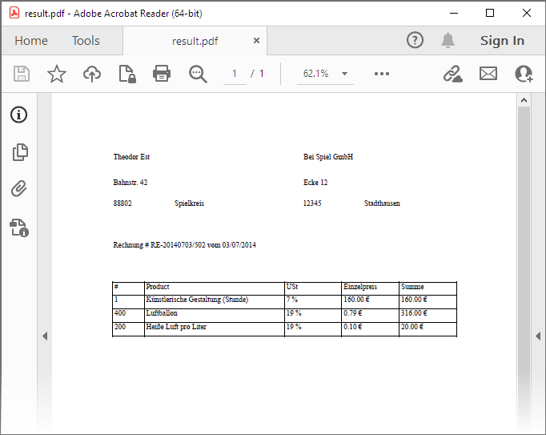

<!-- default badges list -->

<!-- default badges end -->
# Reporting for WinForms - Export a Report to ZUGFeRD

This example demonstrates how to export a simple report to a <strong>PDF/A-3b</strong> (<strong>ISO 19005-3</strong>) file that conforms to the [ZUGFeRD](https://www.ferd-net.de/standards/zugferd) specification used for electronic invoices in Germany.

## Files to Review

* [Form1.cs](./CS/ZUGFeRD_sample/Form1.cs) (VB: [Form1.vb](./VB/ZUGFeRD_sample/Form1.vb))

## Documentation 

* [Export to PDF](https://docs.devexpress.com/XtraReports/2574/detailed-guide-to-devexpress-reporting/store-and-distribute-reports/export-reports/export-to-pdf)
* [Create a Report with a Visual PDF Signature](https://docs.devexpress.com/XtraReports/402208/create-reports/create-a-report-with-visual-pdf-signature)
* [Create an Invoice](https://docs.devexpress.com/XtraReports/117229/create-reports/create-an-invoice)
* [Create an Invoice from Templates](https://docs.devexpress.com/XtraReports/119811/create-reports/create-an-invoice-from-templates)
* [Create a Swiss QR Bill](https://docs.devexpress.com/XtraReports/400351/create-reports/create-a-swiss-qr-bill)

## More Examples

* [How to Export a Report to PDF and Specify Export Options](https://github.com/DevExpress-Examples/reporting-winforms-export-pdf)
* [How to use the digital signature options when exporting a report to PDF](https://github.com/DevExpress-Examples/Reporting_how-to-use-the-digital-signature-options-when-exporting-a-report-to-pdf-e4191)
* [How to Create a Custom DevExpress Report Control](https://github.com/DevExpress-Examples/Reporting-Custom-Controls)
* [Reporting for WinForms - How to Use MailKit to Send a Report as a Document in PDF](https://github.com/DevExpress-Examples/reporting-winforms-mailkit-email-report-pdf)

